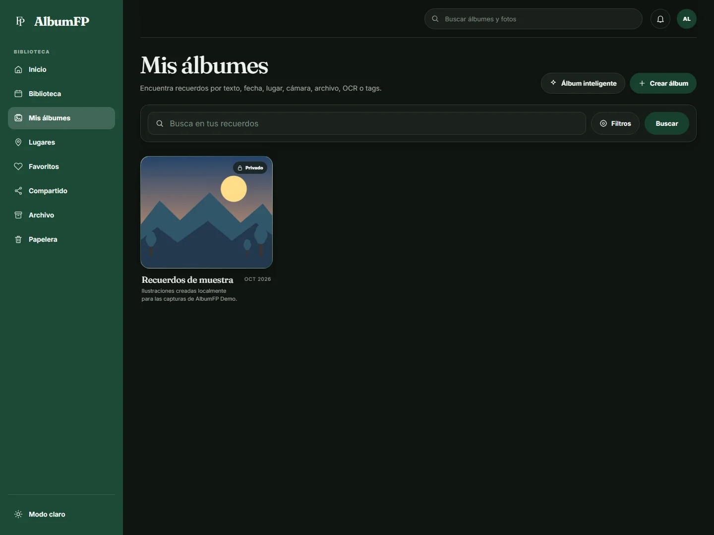
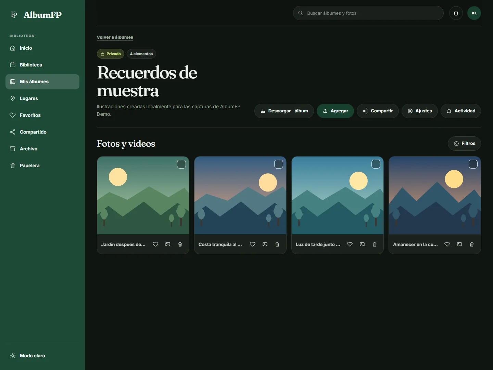
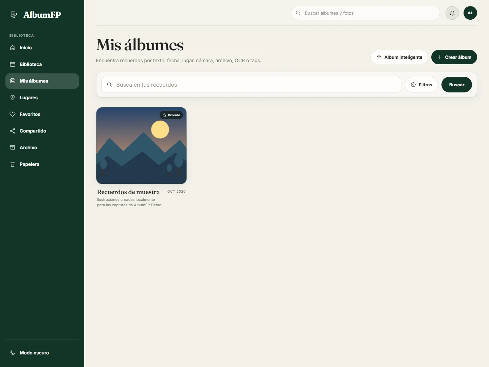
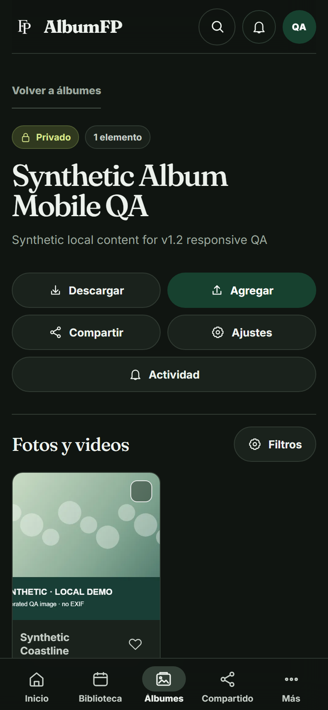

<p align="center">
  
</p>

<h1 align="center">AlbumFP Demo</h1>

<p align="center"><strong>Tus fotos, tus videos y las historias que quieres volver a encontrar.</strong></p>

<p align="center"><a href="https://albumfp.com">Conoce AlbumFP</a> · Demo local v1.3.1</p>

AlbumFP reúne fotos y videos en una biblioteca personal. Ordénalos en álbumes, encuentra cada recuerdo por sus datos, guarda tus favoritos y comparte solo lo que elijas.

Esta edición Demo reproduce la experiencia del producto hasta la serie v1.3 y funciona solo en tu equipo. La versión actual es 1.3.1, un hotfix de la Demo dentro de la serie v1.3; no es la infraestructura de producción de AlbumFP.

> **License:** Source available — non-commercial use only.
> AlbumFP Demo is not open-source software. Commercial use, resale,
> rebranding, public hosting/SaaS operation, misleading claims of authorship,
> and redistribution outside the permissions in LICENSE are prohibited.

## Lo que puedes hacer

- Organizar fotos y videos en álbumes y una biblioteca con búsqueda y filtros.
- Crear álbumes inteligentes que reúnen recuerdos según sus criterios.
- Marcar favoritos, archivar recuerdos y restaurar archivos desde la papelera.
- Compartir álbumes con enlaces de solo lectura o permisos de colaboración.
- Añadir comentarios y consultar la actividad de tus álbumes.
- Elegir portadas de video y reproducir los originales por rangos.
- Mantener los archivos y los datos en almacenamiento local.
- Usar la biblioteca con navegación y búsqueda adaptadas a pantallas pequeñas.
- Instalar la interfaz local como WebApp en el mismo equipo cuando el navegador lo permita.

## Un vistazo

### Escritorio





### Tema claro y teléfono





Las capturas se hicieron en esta Demo con una cuenta y contenido sintéticos. Las cuatro ilustraciones del seed se generan localmente y no incluyen EXIF.

## Probarlo en Windows

Necesitas Windows PowerShell, Python 3.13 o posterior, Node.js 22 o posterior, npm y PostgreSQL 14 o posterior.

```powershell
git clone https://github.com/Fabianrodas/albumfp-demo.git
Set-Location albumfp-demo
.\setup.ps1
.\dev.ps1
```

`setup.ps1` prepara PostgreSQL, crea las bases separadas `albumfp_demo` y `albumfp_demo_test`, y genera `.env` desde `.env.example` con valores locales. La base de datos, las credenciales y los archivos cargados quedan fuera de Git, en `%LOCALAPPDATA%\AlbumFP-Demo`.

La preparacion aplica las migraciones con `alembic upgrade head`; no reinicia ni elimina las bases existentes.

El helper destructivo `python -m schemas.schema` es solo para bases Demo desechables. Al marcar un esquema historico usa `alembic stamp 0001_current_schema_baseline`; las actualizaciones normales usan `alembic upgrade head`.

Abre [http://localhost:4200](http://localhost:4200). Los servicios se enlazan a loopback. Pulsa Ctrl+C en la ventana de `dev.ps1` para detener la Demo.

### Crear contenido sintético

Para probar la galería con contenido original generado localmente, ejecuta una vez:

```powershell
Set-Location backend
.\.venv\Scripts\python.exe scripts\seed_synthetic_gallery.py --confirm-local-demo
```

El comando solo acepta `albumfp_demo` en PostgreSQL loopback, puerto `55432`, y exige `REGISTRATION_MODE=open`; crea la cuenta mediante la ruta normal de registro. Crea una cuenta dedicada `albumfp_demo_synthetic_gallery`, un álbum privado y cuatro ilustraciones propias sin EXIF. Elige una contraseña local en el prompt; el comando no la muestra ni la guarda en el repositorio. Si el registro está cerrado o la cuenta ya existe, el seed se detiene sin modificarla.

## Pruebas

```powershell
Set-Location backend
.\.venv\Scripts\python.exe -m pytest -q
Set-Location ..\frontend
npm.cmd test -- --watch=false
npm.cmd run build
```

## Edición local

La búsqueda en mapas, el clima, el OCR y las sugerencias automáticas están desactivados. La aplicación no envía fotos, metadatos, datos de cuenta ni telemetría a servicios externos. Usa contenido sintético en capturas y pruebas.

## License

AlbumFP Demo is source-available for personal, educational, and evaluation
purposes only under the terms in [LICENSE](LICENSE).

It is **not open-source software**.

Commercial use, resale, sublicensing, public hosting, SaaS operation,
rebranding, misleading claims of authorship, and redistribution or publication
of derivative versions outside the permissions in LICENSE are prohibited
without prior written permission.

The AlbumFP name, branding, logos, screenshots, and original visual assets are
not licensed for reuse except as expressly stated in LICENSE.

Third-party components remain subject to their respective licenses.

See [LICENSE](LICENSE) and [NOTICE](NOTICE).
